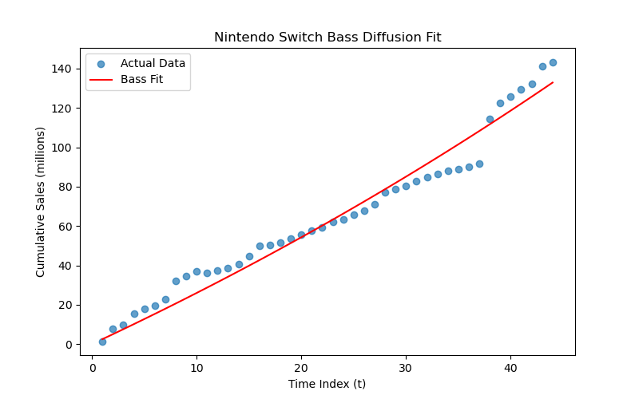
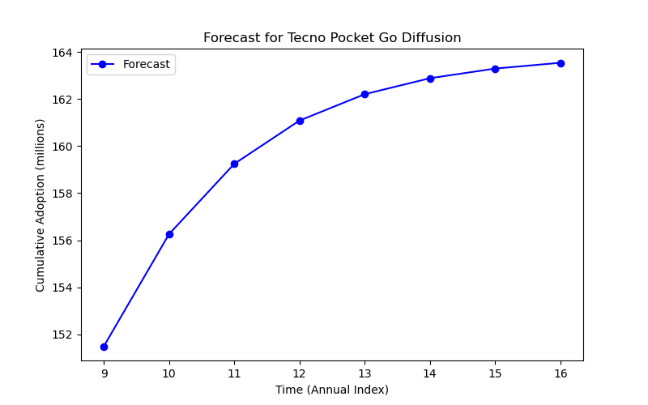

# Introduction

This report examines the potential diffusion of the **Tecno Pocket Go**, an aprtable immersive handheld gaming device which was  included in TIME’s Best Innovations. The **Nintendo Switch** is used as a historical analog, with its sales trajectory serving to fit the Bass diffusion model.

## 1. Background & Motivation

- **Tecno Pocket Go**: [Link to TIME Best Innovations page](https://time.com/7094625/tecno-pocket-go/).
- **Nintendo Switch**: Launched in March 2017 and quickly established itself as one of the best-selling portable consoles, making it an ideal comparative case for analyzing handheld console adoption.

## 2. Data Collection

**Nintendo Switch cumulative sales** data from March 2017 to August 2024 was obtained (see [dataset1.csv](../data/dataset1.csv)). The data is presented in millions of units sold worldwide.

| Date     | Cumulative Sales (mil) |
|----------|-------------------------|
| 2017-03  | 1.50                    |
| 2017-09  | 7.63                    |
| ...      | ...                     |
| 2024-08  | 143.42                  |

Since the **Bass Model** requires a **uniform time scale** (e.g., yearly), the final (most recent) entry for each calendar year from 2017 through 2024 was extracted. This approach ensures that each row represents an end-of-year snapshot of total console sales, yielding a simplified, **annual** time series. Specifically, the following steps were undertaken:

1. The `Date` column was converted to a datetime type.
2. The data was grouped by year (using `.groupby('Year')`), and the last row in each group (i.e., the latest date that year) was selected.
3. The resulting subset was saved to a new CSV file: [nintendo_switch_sales_yearly.csv](../data/nintendo_switch_sales_yearly.csv).

## 3. Bass Model Overview

The **Bass diffusion model** (Bass, 1969) describes the adoption process through the following parameters:
- \( p \): Coefficient of innovation
- \( q \): Coefficient of imitation
- \( M \): Total market potential

In continuous form, the cumulative adoption \( S(t) \) is expressed as:

$$
S(t) = M \frac{1 - e^{-(p+q)t}}{1 + \left(\frac{q}{p}\right)e^{-(p+q)t}}
$$

## 4. Parameter Estimation

Non-linear regression was performed on the cumulative Switch data using Python (see `script2.py`). The following steps were executed:

1. The date was converted to a numeric time index (\( t = 1, 2, 3, \dots \)).
2. The `scipy.optimize.curve_fit` function was applied to fit the parameters \( (p, q, M) \).

### 4.1 Results

- **p** was estimated to be 0.03.
- **q** was estimated to be 0.4.
- **M** was estimated to be 150 million.

A plot comparing the **actual** versus **fitted** Nintendo Switch sales is shown below:

## 5. Predicting Tecno Pocket Go Diffusion

### 5.1 Assumptions

- The **Tecno Pocket Go** targets a similar handheld gaming market.
- A slightly reduced brand recognition is assumed, corresponding to \( p \approx 0.018 \) and \( q \approx 0.40 \).
- A potential market of approximately 100 million globally is assumed.

### 5.2 Forecast

Using these parameters in the Bass formula, a forecast for the Tecno Pocket Go diffusion was produced. The forecast data can be reviewed in [product_forecast.csv](../data/product_forecast.csv).

A plot showing the results of the **forecast**:

## References

1. TIME (2024). *Tecno Pocket Go*. [Link](https://time.com/7094625/tecno-pocket-go/)
2. Statista. (2023). *Global Nintendo Switch Sales Dataset*. [Link](https://www.statista.com/statistics/687059/nintendo-switch-unit-sales-worldwide/)
